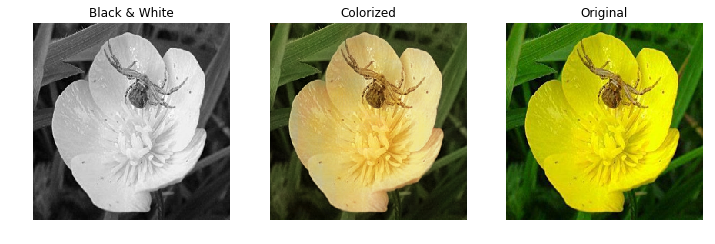
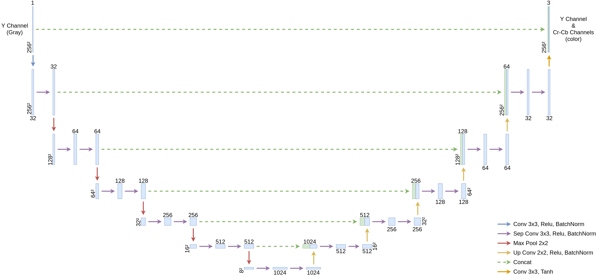
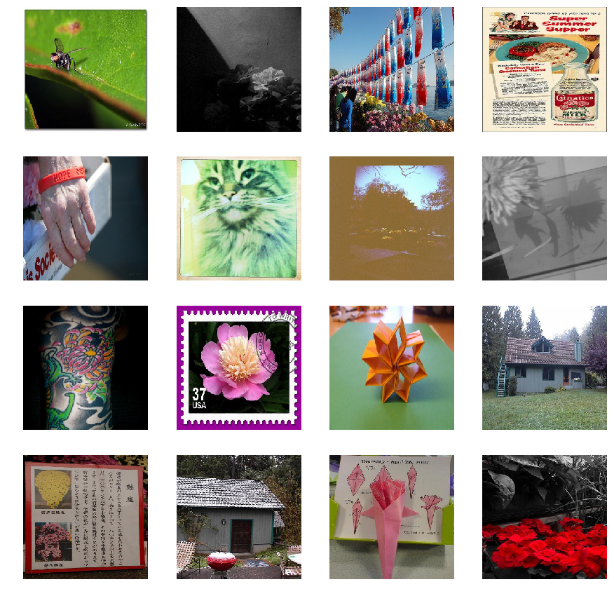
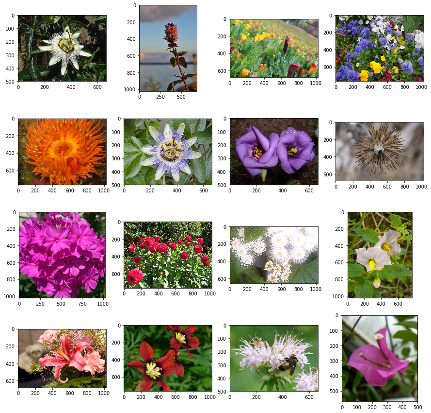
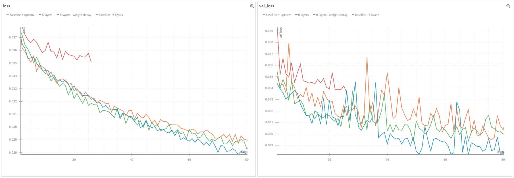
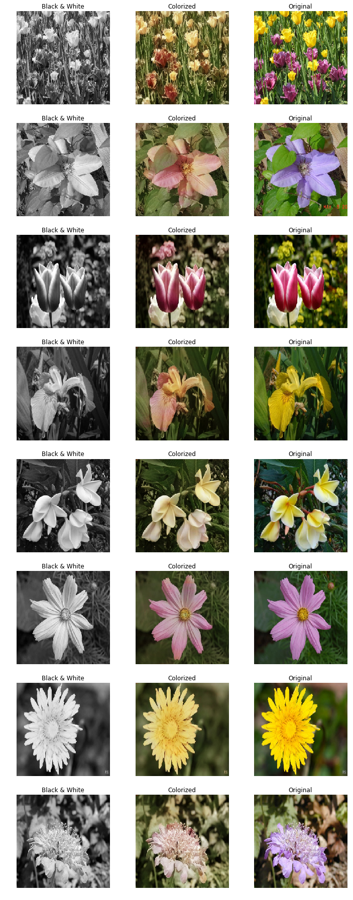
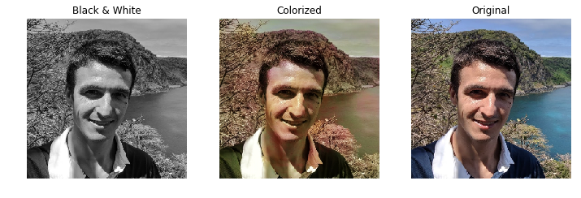

# Colorizing Images ML Challenge

*This repository presents my solution to the [Weights & Biases Colorizing Challenge](https://www.wandb.com/challenge). A neural network has been developed and trained to colorize black & white images of flowers.*

## Introduction

The objective of this challenge is to colorize black & white pictures of flowers in the most realistic manner. This process is often applied on black and white movies or for other artistic creations. However, it is traditionnally a tedious task performed manually, frame by frame.

The intent of this project is to automate the colorization of black & white pictures through a neural network. While it is probably impossible to predict exactly the correct colors due to the loss of information (a tullip for example can be of many different colors), the recognition of items within a picture (tree, leaf, type of flower, sky, insect, etc) should lead to a realistic color.

Contrarily to classification, every object needs to be recognized at a pixel level, similar to the instance segmentation problem. However, instead of predicting only one class per pixel, a color needs to be predicted.

At a higher level, the network needs to have an understanding of the black & white image such as: "there is a dark rose, which is then probably red (other colors would be too clear), in front of a tree, most likely brown with green leaves". Its understanding leads then to the reconstitution of the image, pixel by pixel.

## Usage

Dependencies can be installed through `requirements.txt` or Pipfile.

The following files are present:

- `color.py` is used to create and train the neural network ;
- `data_process.py` contains functions to pre-process and sort images ;
- `run.py` is used to perform inference on an image.

Pre-trained models can be found on the [Releases](https://github.com/borisd13/colorizer/releases) page of the project.

Latest model is based on [Training Run "0uiwhl8e"](https://app.wandb.ai/borisd13/colorizer/runs/0uiwhl8e) and can be downloaded under [release v0.1](https://github.com/borisd13/colorizer/releases/download/v0.1/0uiwhl8e.073.h5).

Sample usage for colorizing an image with pre-trained model:

`run.py model/0uiwhl8e.073.h5 <input_image> <output_image>`

The first argument corresponds to a pre-trained model.

## Architecture

The inference is performed in the YCrCb color space. This let us reduce the output dimension as the Y channel remains the same on a color or black & white image and contains the entire information on a black & white picture.

The neural network predicts Cr & Cb channels, which is then used to reconstitute the colored picture through post-processing.

Inputs and outputs are normalized to the range [-1 - 1] for faster training. The last layer uses a tanh activation function in order to have a bounded prediction.

An adam optimizer is used and the loss is based on the mean squared error.

The neural network is inspired by a few architectures:

- [U-net](https://arxiv.org/abs/1505.04597) which is efficient at image segmentation ;

- [MobileNets](https://arxiv.org/abs/1704.04861) with the use of separable convolutions to reduce the number of parameters ;

- Efficient deep convolution networks for classification such as [ResNets](https://arxiv.org/abs/1512.03385) for the tuning of hyperparameters (depth, width, etc) required to identify items in the picture.

## Data

In order to train the neural network, label data needs to be provided. Color images were used to define target labels and turned to black & white to simulate input data.

The neural network was initially developed with [provided dataset](https://storage.googleapis.com/l2kzone/flowers.tar).

However, several images were not relevant.

*Samples of non-relevant data*

In order to improve training, the data is sorted manually:

- remove black & white pictures (a script was developped in `data_process.py`) ;
- remove low quality picture (can base it on the size with the command `find . -name "*" -size -16k -delete`) ;
- remove "artistic" pictures which apply a filter or turn the image partially black & white ;
- remove pictures of non-flower items (it seems dogs end up in any type of datasets…) ;
- remove pictures that seem difficult to color (landscape from too far away, or too difficult background).

After identifying overfitting during training, additional steps were taken:

- Find additional datasets ;
- Perform data augmentation.

The additional datasets were also manually sorted:

- [Oxford Flower datasets](http://www.robots.ox.ac.uk/~vgg/data/flowers/)
- [Google Open Images V4](https://storage.googleapis.com/openimages/web/index.html) is a very large and high quality dataset that was largely used (but not entirely due to its size and time required to manually sort it)

Finally, data augmentation could be performed thanks to the high resolution images from the datasets:

- image randomly cropped (up to 15% of image size on each side) which has also the effect of resizing the picture ;
- vertical flip.

*Samples of clean dataset*

Validation dataset was also cleaned and extended with more data for more stable accuracy measurements.

## Results

[Weights & Biases](https://www.wandb.com/) was used to monitor the training and optimize the architecture:

- [First baseline](https://app.wandb.ai/borisd13/colorizer/runs/d0k7xg70) was set with 5 layers and 32 initial filters

- [Using up-convolution](https://app.wandb.ai/borisd13/colorizer/runs/6dukn40t) instead of up-sampling (per first baseline) did not bring any improvement while increasing significantly model size (it was nevertheless used in further architectures) ;

- [Using 7 layers](https://app.wandb.ai/borisd13/colorizer/runs/pcj7yuvn) on the U-net type architecture lead to overfitting and the depth was then reduced to 6 layers with more data augmentation ;

- [Using 64 initial filters](https://app.wandb.ai/borisd13/colorizer/runs/ljg8lgq6) lead to a too large model (above 200Mo) and was much slower to train than when using deep structures ;

- [Using weight decay](https://app.wandb.ai/borisd13/colorizer/runs/u034weef) lead to a too slow training, even after decreasing several times its contribution to total loss ;

- The best results were obtained with [6 layers, 32 initial filters and no regularization](https://app.wandb.ai/borisd13/colorizer/runs/0uiwhl8e)

The most interesting runs can be visualized through the [project summary run](https://app.wandb.ai/borisd13/colorizer?view=default).

The network performs surprisingly well. In addition to identifying flowers, it also often colorizes in a realistic manner the background.

We can notice the following:

- most flowers are colorized correctly ;

- when a type of flower has several possible colors, it is often colorized in a light pink, probably due to average loss minimization between all possibilities ;

- the sky is ofen colorized in a light green, probably due to the fact that we have too many samples of green background and not enough of the sky ;

- insects (butterflies, bees, etc) are often colorized realistically ;

- some pictures contain some artifacts with a little patch colorized vividly and randomly.

TODO include more examples to illustrate each observation

The results are nevertheless impressive considering the difficulty we would have to choose manually the right colors on several of the black & white pictures.

Finally, if we want the neural network to colorize a picture it was not trained on (such as a person), it won't work so well…
As expected, the most common colors from the flower dataset (light pink and green) are used even when the picture does not look like a known flower.

## Future work

Here are a few ideas that were not tested due to lack of time:

- use of CIE L\*a\*b\* color space ;

- regularization through dropout ;

- Weight decay L2 regularization was attempted but unsuccessful, more tuning may be beneficial ;

- Automatically balance the training samples based on their main colors (through histogram) to prevent having too many flowers colorized in pink ;

- Add even more data from Google Open Images V4 ;

- Try different number of layers, width and number of convolutions per layer ;

- Use ResNet (pre-trained or not) for first layers (at least up to block 4) ;

- Keep list of accuracy for hard mining and do weighted sample based on accuracy at last epoch ;

- Train longer and auto-update learning rate after a certain number of epochs ;

- perform inference from ensemble of models either on full picture or different crops/scales ;

- investigate further use of up-convolution vs simple upsampling (did not lead to better results while increasing model size).

## Acknowledgements

- Weights & Biases for organizing this challenge and providing a convenient interface for monitoring training of neural networks ;

- Datasets from [Oxford](http://www.robots.ox.ac.uk/~vgg/data/flowers/) and [Google](https://storage.googleapis.com/openimages/web/index.html) ;

- [Toolkit from Angelo Vittorio](https://github.com/EscVM/OIDv4_ToolKit) for downloading data from Open Images v4 dataset ;

- Papers previously quoted for architecture inspiration.
